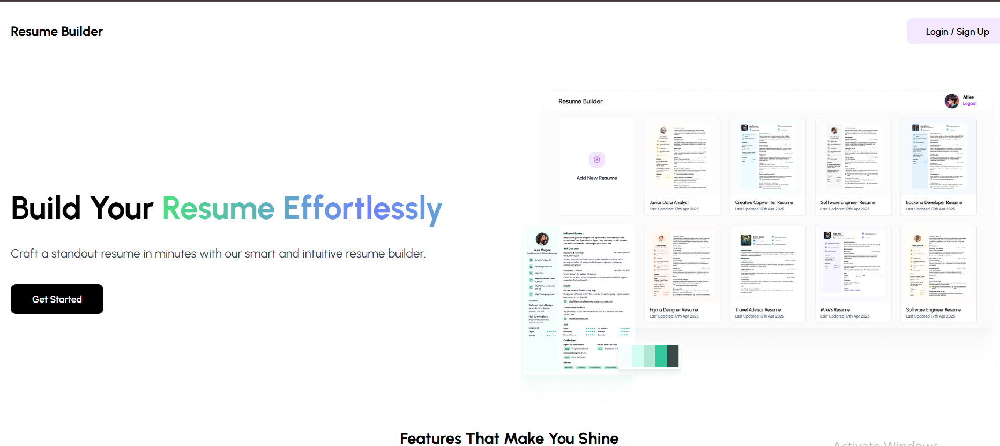
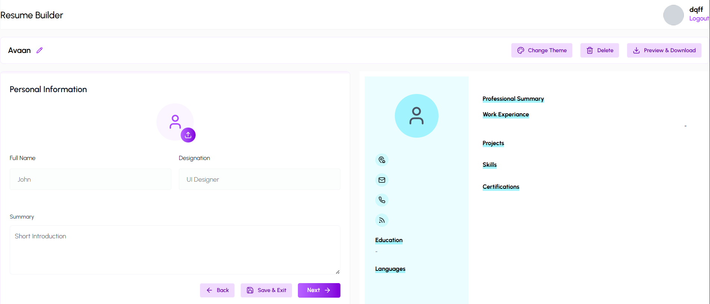

# Resume Builder (MERN Stack)

A full-stack **Resume Builder web application** built using the MERN stack (MongoDB, Express.js, React.js, Node.js). This project allows users to register, log in, create, and manage professional resumes through a clean and responsive interface.

---

## 🚀 Features

- 🔐 User Authentication (Signup / Login)
- 🧾 Create and manage resume content
- ✍️ Edit personal details, education, skills, and experience
- 📄 Resume preview
- 📱 Fully responsive UI
- ⚡ Fast and modern React frontend
- 🌐 RESTful API backend
- 🗄️ MongoDB database integration

---

## 🛠️ Tech Stack

### Frontend
- React.js  
- Tailwind CSS
- Axios  

### Backend
- Node.js  
- Express.js  
- MongoDB  
- Mongoose  

### Tools & Platforms
- Git & GitHub  
- VS Code  
- MongoDB Atlas  

---

## 📂 Project Structure
Resume-Builder-Mern/

│

├── backend/

│   ├── config/           # Database connection, environment config

│   ├── models/           # Mongoose schemas

│   ├── routes/           # API routes

│   ├── controllers/      # Business logic (if present)

│   ├── middleware/       # Auth & error handling middleware

│   ├── server.js         # Backend entry point

│   └── .env.example      # Environment variables sample

│

├── frontend/

│   ├── public/           # Static files

│   └── src/

│       ├── components/   # Reusable UI components

│       ├── pages/        # Application pages

│       ├── services/     # API calls (Axios)

│       ├── App.js        # Main React component

│       └── index.js      # React entry point

│

├── .gitignore

├── README.md

└── package.json         # Project metadata (if root-level)

## ⚙️ Installation & Setup

Follow these steps to run the project locally.

### 1. Clone the repository

git clone https://github.com/MohammadAvaan/Resume-Builder-Mern.git
cd Resume-Builder-Mern

### 2. Setup Backend

cd backend
npm install

Create a .env file inside the backend folder and add:
MONGO_URI=your_mongodb_connection_string
PORT=8000

Run backend server:
node server.js

Backend will run at:
http://localhost:8000

### 3. Setup Frontend

Open a new terminal:

cd frontend
npm install
npm start

Frontend will run at:
http://localhost:3000

## 📸 Screenshots

## 🌟 Future Improvements

- Resume PDF download  
- Multiple resume templates  
- Drag and drop sections   
- Deployment on cloud  

## 👨‍💻 Author

**Mohammad Avaan**

- GitHub: https://github.com/MohammadAvaan  
- LinkedIn: [https://www.linkedin.com/in/mohammad-avaan-989075288/?originalSubdomain=in]

## 📄 License

This project is open source and available under the MIT License.

---

⭐ If you found this project helpful, don't forget to star the repository!

